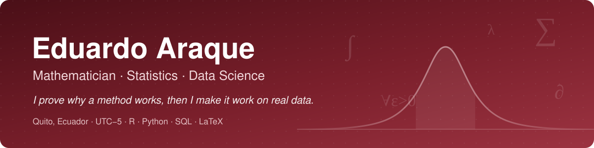

<a href="README.md">English</a> · <b>Español</b>

  

  
  
  

## Sobre mí

Soy estudiante de último año de **Matemática pura** en la Universidad Central del Ecuador y trabajo donde la matemática rigurosa se encuentra con datos reales. Mi formación (análisis real y funcional, teoría de la medida, análisis numérico, ecuaciones en derivadas parciales, estadística matemática) es lo que uso para **comprobar que un análisis es correcto**, no solo que corre.

- **Metodología de pronóstico para un ente regulador nacional.** En mis prácticas en la Agencia de Regulación y Control de Hidrocarburos elaboré una metodología de pronóstico y detección de anomalías de 73 páginas (SARIMAX con análisis de intervención, propuesta para sustituir la de 2017), con su *pipeline* en Python y manuales de uso.
- **Resultados honestos.** Audito *pipelines*, corrijo lo que está mal y reporto lo que no funciona: en un proyecto de predicción de lluvia corregí cuatro errores críticos de preprocesamiento y documenté que el modelo no superaba una línea base simple.
- **Cifras verificadas.** Rehago a mano lo que calculan las librerías: en mi proyecto de muestreo complejo reproduje 98 de 98 estimaciones del paquete `survey` de R.

## En qué puedo ayudar

| Necesidad | Qué hago | Herramientas |
|---|---|---|
| Encuestas y datos oficiales | Estimación con factores de expansión, estratos y conglomerados; errores estándar correctos, efectos de diseño, estimación por dominios | R (`survey`, tidyverse) |
| Pronóstico y detección de anomalías | SARIMA/SARIMAX, análisis de intervención, intervalos de predicción, reglas de monitoreo | Python (statsmodels), R |
| Modelos predictivos | Variables sin fuga de información, validación temporal, calibración, comparación con líneas base | Python (scikit-learn, XGBoost) |
| Informes reproducibles | Análisis donde cada cifra se rastrea hasta el código; informes y documentación | Quarto, LaTeX, Word, Git |
| Contenido matemático y entrenamiento de IA | Demostraciones, diseño y revisión de problemas, soluciones paso a paso en español e inglés | LaTeX |

## Proyectos destacados

<table>
  <tr>
    <td width="50%" valign="top">
      <h3><a href="https://github.com/Eduardo0602/muestreo-complejo-ser-estudiante/blob/main/README.es.md">Muestreo complejo</a></h3>
      <em>¿Cuánto se equivoca quien ignora el diseño muestral?</em>  
      Evaluación nacional Ser Estudiante (50 578 estudiantes): ignorar los conglomerados subestima el error estándar entre 1,8 y 3,8 veces; ignorar los pesos sesga la media en más de 10 puntos.  
      <code>R</code> <code>survey</code> <code>tidyverse</code>
    </td>
    <td width="50%" valign="top">
      <h3><a href="https://github.com/Eduardo0602/eda-limpieza-defunciones-ecuador-pandas-sql/blob/master/README.es.md">EDA con datos sucios</a></h3>
      <em>¿Qué hay que corregir antes de confiar en un registro oficial?</em>  
      Registro de defunciones 2021 del INEC (107 648 registros): 369 685 nulos disfrazados detectados y cada decisión de limpieza justificada.  
      <code>Python</code> <code>pandas</code> <code>SQL</code>
    </td>
  </tr>
  <tr>
    <td width="50%" valign="top">
      <h3><a href="https://github.com/Eduardo0602/regresion-lineal-numpy-desde-cero/blob/main/README.es.md">Regresión lineal desde cero</a></h3>
      <em>¿Puede un plano predecir la profundidad de los sismos de Ecuador?</em>  
      Existencia y unicidad del mínimo demostradas; ecuaciones normales y descenso por gradiente en NumPy, que coinciden con scikit-learn hasta 2,84e-13.  
      <code>Python</code> <code>NumPy</code> <code>optimización</code>
    </td>
    <td width="50%" valign="top">
      <h3><a href="https://github.com/Eduardo0602/algebra-lineal-visual-numpy/blob/main/README.es.md">Álgebra lineal visual</a></h3>
      <em>¿Qué hace geométricamente una matriz?</em>  
      Transformaciones lineales, valores propios y SVD desde cero; compresión de imágenes y una demostración algebraica y numérica de que PCA es la SVD de los datos centrados.  
      <code>Python</code> <code>NumPy</code> <code>SVD</code>
    </td>
  </tr>
</table>

## Herramientas

**Lenguajes** &nbsp;

**Estadística y ML** &nbsp;

**Datos** &nbsp;

**Flujo de trabajo** &nbsp;

## Por qué un matemático puro

| Formación (asignaturas en la UCE) | Qué aporta al trabajo con datos |
|---|---|
| Teoría de la medida I–II, teoría de la probabilidad | Saber exactamente qué estima un estimador y bajo qué supuestos |
| Estadística matemática, inferencia estadística, modelos lineales | Diseños muestrales, verosimilitud, intervalos de confianza y pruebas bien hechas |
| Álgebra lineal I–III | PCA, SVD, mínimos cuadrados y condicionamiento entendidos, no memorizados |
| Análisis real I–V, análisis funcional I–II, optimización | Los argumentos de convergencia y optimización detrás del *machine learning* |
| Análisis numérico I–IV | Cálculo estable: resolver sistemas en lugar de invertir matrices, control del error |
| EDP I–IV, sistemas dinámicos, modelación matemática | Convertir un proceso físico o económico en un modelo con supuestos explícitos |
| Escritura de demostraciones | Encontrar el supuesto oculto que hace fallar un resultado |

## Ahora mismo

- Último año de Matemática: cursando Modelos Lineales, Teoría de la Probabilidad, Optimización, Sistemas Dinámicos y Modelación Matemática.
- Añadiendo estimación de varianza por *bootstrap* y un informe en Quarto al proyecto de muestreo complejo.
- Disponible para **trabajo remoto de medio tiempo o freelance** en ciencia de datos, estadística o matemática para entrenamiento de IA.

---

Portafolio <em>De Matemático a Data Scientist</em> · crece con cada proyecto

